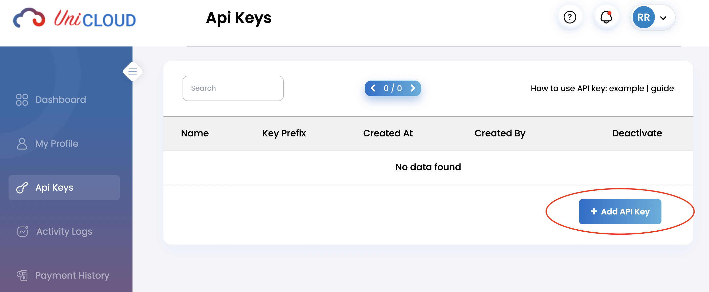
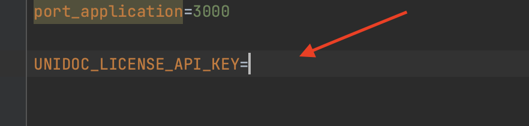
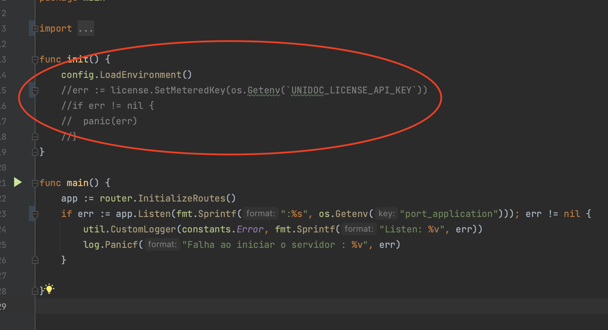
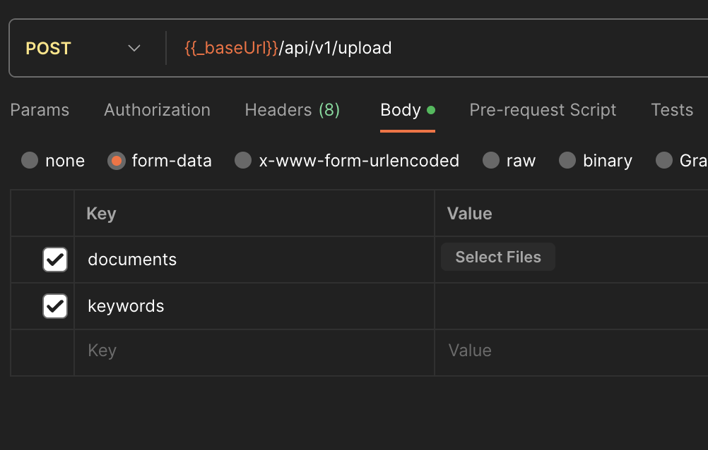

# Filter Files

O `Filter Files` é um projeto desenvolvido em Go (Golang) que permite aos usuários buscar por palavras-chave específicas em um conjunto de arquivos. Este projeto é capaz de processar arquivos com as extensões `.txt`, `.pdf`, `.doc` e `.docx`, utilizando goroutines e canais para um processamento eficiente e concorrente.

## Funcionalidades

- **Busca de Palavras-Chave**: Permite aos usuários buscar por palavras-chave específicas dentro dos arquivos.
- **Suporte a Múltiplas Extensões de Arquivo**: Compatível com arquivos `.txt`, `.pdf`, `.doc` e `.docx`.
- **Processamento Concorrente**: Utiliza goroutines e canais para processamento simultâneo de múltiplos arquivos.
- **Retorno de arquivos**: Retorna apenas os arquivos que deram match com as palavras-chave.


## Como Usar

### Pré-requisitos

- Go (Golang) instalado em sua máquina. [Instruções de instalação](https://golang.org/doc/install).
- Api Key (Unidoc) para realizar a leitura dos arquivos em pdf você precisar de uma key do api da unipdf. [Instruções do pacote](https://github.com/unidoc/unipdf). 


### Inserindo key Unidoc (opcional)
1. Crie uma conta: https://cloud.unidoc.io/login
2. Vá na aba de Api Keys e adicione ua nova key



3. Insira a key no .env do projeto



4. Retire o comentario da func init




- Esse processo é opicional para quem quer utilizar arquivos em pdf.

  

### Requisção
{{_baseUrl}} = http://localhost:3000


1. Postman
   
2. Terminal
    - curl -X POST [URL] \
   -F "documents=@/caminho/para/o/arquivo1.ext" \
   -F "documents=@/caminho/para/o/arquivo2.ext" \
   -F "keywords=palavra1 palavra2 palavra3"


### Em desenvolvimento
- O projeto ainda esta em desenvolvimento existem muitas melhorias a serem feitas.

### Contribuições
- Contribuições para melhorar o Filter Files são bem-vindas. Sinta-se à vontade para fazer um fork do repositório, realizar mudanças e abrir um pull request com suas melhorias.


### Executando


   ```bash
   go mod tidy
   go run main.go
   

